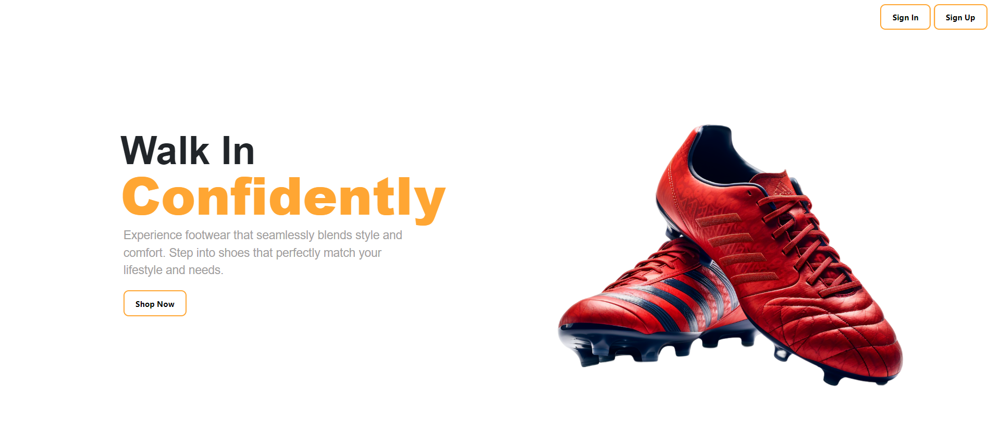
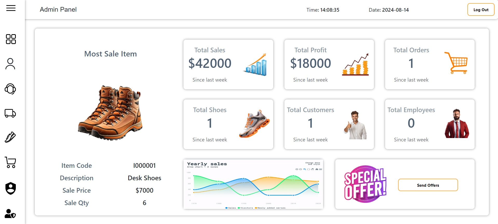
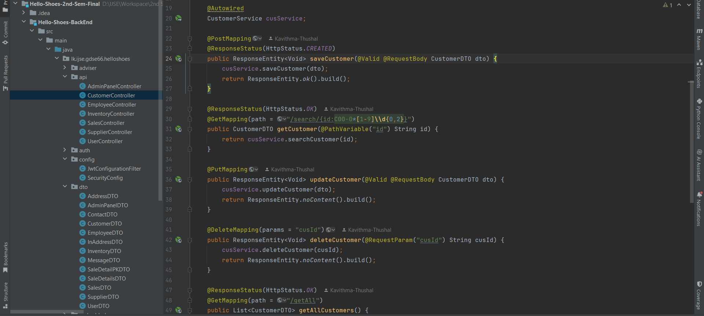

# 🌟 Hello Shoes (PVT) LTD.

The Hello Shoes (PVT) LTD. repositories comprise the comprehensive Shoe Shop Management System. The frontend repository,
built with modern web technologies, delivers an engaging and intuitive interface for customers to explore the shoe
catalog, place orders, and manage their accounts, while also providing administrative features for inventory management,
order processing, and sales data analysis. This frontend pairs seamlessly with the backend repository, which is
implemented using Spring Boot. The backend offers robust RESTFul APIs that handle inventory management, order
processing, customer management, and authentication. Leveraging Spring Boot's powerful features, such as dependency
injection and JPA, it ensures efficient and scalable operations, supporting the frontend with a strong foundation for a
smooth and responsive shoe shopping experience.

## 🛠️ Tech Stack

### FrontEnd

✅ **HTML** 
✅ **CSS** 
✅ **JS** 
✅ **AJAX** 
✅ **jQuery** 
✅ **Bootstrap** 

### BackEnd

✅ **Spring Boot** 
✅ **Spring Data JPA** 
✅ **Spring Validation** 
✅ **Spring Security** 
✅ **JSON Web Token (JWT)** 
✅ **MySQL** 

## 🚀 Features

### FrontEnd

✅Single-page application (SPA) architecture for smooth navigation and enhanced user experience 
✅Integration with backend RESTFul APIs to fetch and update shoe inventory and order information 
✅Interactive components for browsing products, adding items to cart, and completing checkout processes 
✅Admin dashboard with data visualization tools for monitoring sales, inventory levels, and customer metrics 

### BackEnd

✅RESTFul API endpoints for CRUD operations on shoe inventory, orders, and customers 
✅Integration with Spring Security for secure userEntity authentication and role-based access control 
✅Utilization of Spring Data JPA for interacting with the underlying database 
✅Implementation of validation and exception handling for robust error management 

## 📸 Screenshots

### Home

### SignUp

### SignIn

### Admin Dashboard

### Codes

## 🔐 Usage

1. Clone the repository `git clone https://github.com/Kavithma-Thushal/Hello-Shoes-2nd-Sem-Final.git`
2. Install backend dependencies using the `pom.xml`
3. Launch the application by opening the `index.html` file in your preferred web browser.

## 📝 Version

**1.0.0**

## 📬 Get in Touch

Got any bugs, issues, or need help understanding the code? Feel free to reach out!

📧 [kavithmathushal9007@gmail.com](mailto:kavithmathushal9007@gmail.com)

#### This project is licensed under the [Apache License](LICENSE)

#### © 2024 All Rights Reserved | Designed by [Kavithma Thushal](https://github.com/Kavithma-Thushal)

